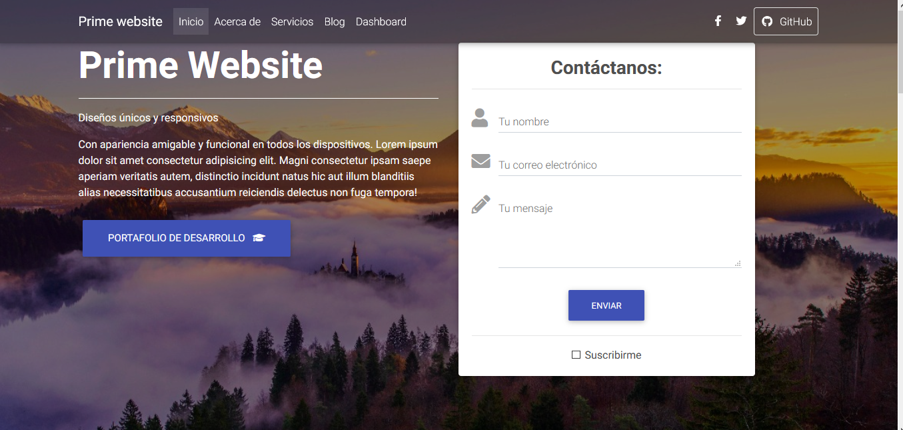
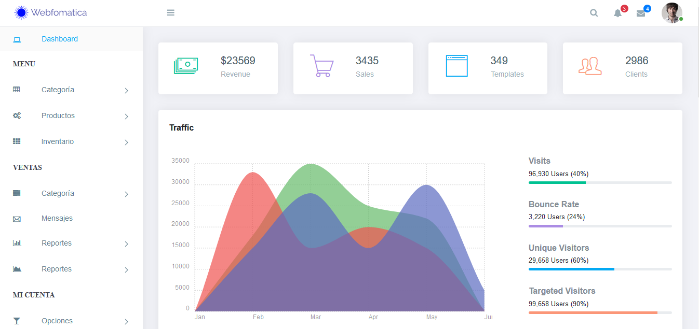

# Website-Dashboard
    Desarrollado con django 3 y postgresql 
# Página principal

# Dashboard

    
# Código

Siéntate libre de utilizarlo y modificarlo

# Despliegue

<a href="https://website1soe.herokuapp.com/" >
    Aquí puede visitar el sitio desplegado
</a>

# Fuentes Template
https://github.com/puikinsh/ElaAdmin  
https://github.com/mdbootstrap/Landing-Page-Template-Bootstrap
